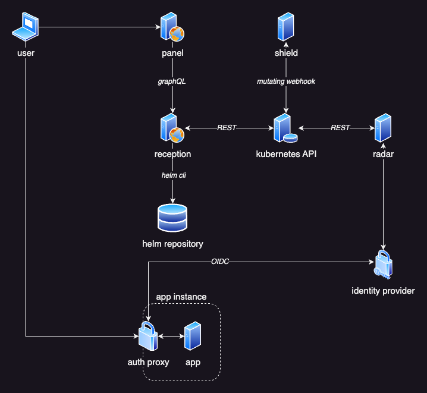
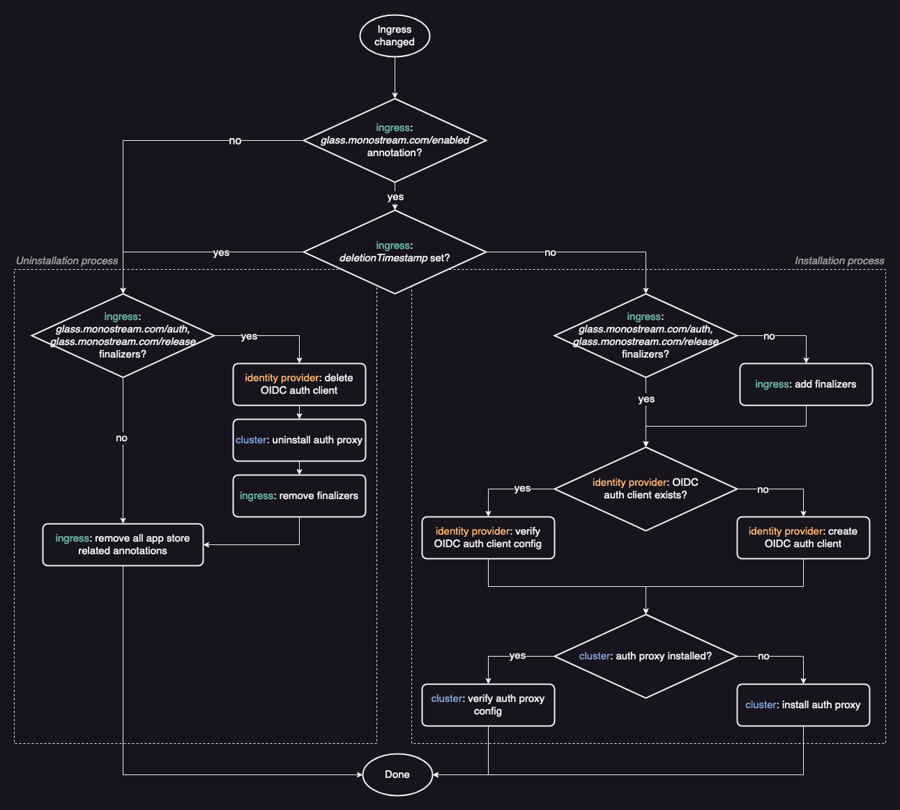

# Architecture

Emporium is designed around a robust and loosely-coupled microservice architecture. This approach improves security and resilience by compartmentalization. Every service serves a distinct purpose, which drastically simplifies the complexity of the source code of each service, simplifying maintenance and helping new developers get started. Below, we delve into the specifics of each component, their interactions, and the technologies that bring Emporium to life.

## Radar

Radar, written in Go, configures, deploys and manages the Glass proxy in front of each ingress of an Emporium app instance. Radar manages this proxy throughout it's whole lifecycle, continuously ensuring correct configuration and even updating it to new versions. Under the hood, it uses Helm to deploy and manage the proxies.

As a [Kubernetes controller](https://kubernetes.io/docs/concepts/architecture/controller/) it tracks all changes to ingress objects. Ingresses containing any Emporium annotations or finalizers are split into two cases.

The first are ingresses that contain the `emporium.build/app-name` annotation and are __not__ marked for deletion (the `metadata.deletionTimestamp` field is not set). Internally these ingresses are referred to as _enabled instances_. It does not matter if an ingress was freshly created or if it only had some modification done to it.

The second case are ingresses that have the `emporium.build/app-name` annotation or any finalizer set. This might include ingresses that are marked for deletion or had the `emporium.build/app-name` annotation removed. In both cases the finalizers indicate that there is some cleanup to be done. For example, after deploying a Glass proxy for an ingress, Radar adds the `emporium.build/release` finalizer to it. Later in its lifecycle when that ingress is requested for deletion, Radar will be notified (because the [`metadata.deletionTimestamp` field is set](https://kubernetes.io/docs/concepts/overview/working-with-objects/finalizers/#how-finalizers-work) on the ingress). It will then uninstall the proxy and clean-up all related resources. Once cleaned up, it will remove the finalizer indicating the ingress can be safely deleted by Kubernetes.

To configure the Glass proxy, Radar fetches the respective Emporium secret for an app. The name of the secret corresponds to the value of the `emporium.build/app-name` annotation suffixed with `-emporium`. It then uses the OIDC configuration found within the secret to deploy the Glass proxy. If a proxy is already deployed, it ensures that the correct configuration is applied. Because proxy configurations are continuously enforced, Radar will automatically upgrade proxies to new versions if a new Emporium release is deployed on your cluster. At startup, every ingress object on the cluster is passed once through the control loop of Radar.

::: info TODO
Should radar create new OIDC clients for ingresses / app instances that don't have one yet? This happens if a user manually (e.g. via kubectl) adds the `emporium.build/app-name` annotation to an ingress. When installing an app via panel UI, the OIDC client has to be created in reception, so the credentials can be passed to `values.emporium.yaml` for rendering the Helm values.
:::

::: tip Idea — What if
On app install, Radar would simply create a secret with all the normalized input provided by the user. This secret is then picked up by Builder. Builder notices that there is no OIDC config yet and creates the corresponding client. In the next iteration of the builder control loop (that was triggered by the previous change to the secret) it notices that there is no corresponding Helm release to that config. It fetches the `values.emporium.yaml` from the db and renders it using the values and integration configs from the secret. The resulting values are passed to `helm install`.

For ingresses where `emporium.build/app-name` was manually added, Radar would create the secret (without creating the OIDC client). Builder would then react to it and complete the same process as described above.
:::

## Shield

Shield, also written in Go, is responsible to ensure that traffic going to an Emporium app instance is always routed through a Glass proxy.

It is registered as a [mutating webhook](https://kubernetes.io/docs/reference/access-authn-authz/admission-controllers/#mutatingadmissionwebhook) for ingress resources on the cluster. This allows it to rewrite the service targets of ingresses, before they are applied to the cluster. Similar to Radar, it also filters ingresses based on annotations and ignores all ingresses that don't contain any Emporium annotations. It rewrites the target service of all relevant ingresses to `<ingress-name>-glass`. This same naming convention is later used by Radar to deploy the Glass proxy. Once the Glass proxy is deployed, it will forward all traffic to the original target services of the ingress.

Note that at the time Shield rewrites the ingress target service, the proxy is not yet deployed. But it's crucial that this rewrite is done before the ingress is deployed to the cluster. So that unprotected apps are never (not even for a short time period) directly accessible from the internet.

When Shield rewrites the target services of an ingress, it stores the original configuration in the `emporium.build/original-configuration` annotation. This allows Shield to reset a modified ingress to it's original state if the `emporium.build/app-name` annotation is removed.

## Reception

Reception, you guessed it, is also written in Go. It exposes a GraphQL API that is consumed by Panel. It installs, updates and uninstalls Emporium apps and lists all available apps in the catalog. Additionally it manages PVCs, lists namespaces and interacts with the database to fetch data such as E-Mail configs defined by the user.

When installing an app, Reception first validates all inputs. It checks if the app name is valid and does not already exist and if the configuration of [integrations](../reference/integrations/dns) is correct. It will then prepare the configured integrations. For example it will create an OIDC client in the identity provider or fetch information about PVCs of the [storage integration](../reference/integrations/storage) (if enabled). This information is then used to render the `values.emporium.yaml` template, resulting in the values passed to `helm install`. Once the Helm installation succeeds it will store the relevant configuration in a Kubernetes secret. These secrets are queried when listing installed apps.

When updating an app, Reception will go through basically the same flow as in the installation process. But instead of doing `helm install` it will (obviously) do `helm upgrade` and not create a new secret but update the existing.

::: info TODO
Currently Emporium is not aware of changes done manually (using the Helm CLI) to a Helm release managed by Emporium. This means that the actual configuration can deviate from the one stored in the Emporium secret. Once the user does update an app, it will use the configuration stored in the secret, overwriting any manual changes done by the user.
:::

## Indexer

Indexer is another Go service. It is responsible to import all Helm charts stored in the configured repositories. It imports metadata on every chart version and stores it in the postgres database. It downloads every version of every chart, extracts files such as `README.md` and `values.emporium.yaml` and stores them in the database. It automatically removes charts from the database that are no longer present in the source repository. If a version of a chart already exists in the database, it compares their digests and only syncs it again if it changed.

## Builder (future work)

Builder is a planned and not yet implemented service. Here's the motivation and planned design for it.

Running `helm install` requires a service account with a lot of privileges, which can be a threat to cluster security. Currently, this is done by Reception, which also hosts the GraphQL API endpoint, a common entrypoint for attackers.

The goal is to create a separate services to mitigate this security risk. This service will act as a Kubernetes controller on secret resources that are marked with certain Emporium labels. Once a secret is modified, Builder will fetch the corresponding `values.emporium.yaml` template from the database, pass the values stored in the secret to it and use Helm to install or upgrade the respective Helm release.

This proposed solution will allow to deploy Reception with a less privileged service account and reduce the attack surface for privileged services account drastically.

## Panel

Panel, developed using Vue with TypeScript, is the user-facing component of Emporium. It communicates with Reception via a GraphQL API.