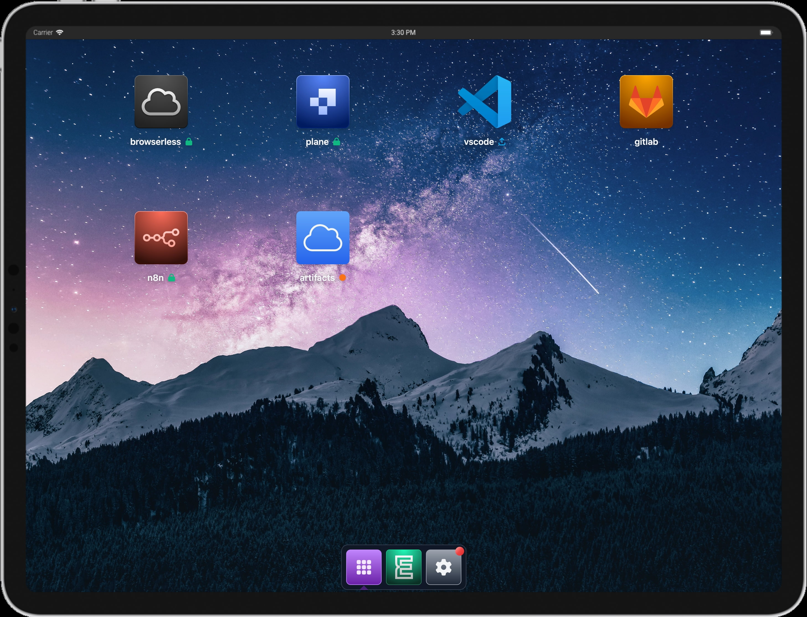

# Overview

Emporium is a user-friendly platform that lets you deploy pre-configured apps and services in a snap. [more here](https://emporium.build)

With its built-in automatic authentication, even applications lacking their own won't be exposed to the public internet.

Emporium can be seamlessly installed on your own Kubernetes cluster. By hosting it yourself, you maintain complete sovereignty over your data and applications. With Emporium, you're fully in control of your data and the apps you deploy.

::: danger 

**Disclaimer:** By installing Emporium, you acknowledge and accept that the process and its outcomes are solely your responsibility. Emporium is currently in its alpha stage and may contain bugs. We do not assume liability for any issues, data loss, or other adverse events that may occur. Use at your own risk.
:::

## Usecases
- **Development Ecosystem:** Host and manage your development environment.
- **File Hosting:** Operate your own file storage solutions.
- **Automation Tools:** Deploy and manage your automation utilities.
- **Collaboration Tools:** Set up your private collaboration platforms.

## Features

- **Single-Click Installations:** Access curated app collection for easy, one-click installations, streamlining your setup process.
- **Unified Authentication:** Benefit from built-in authentication across all apps, bolstering security, even for those without native login features.
- **App Launcher:** Utilize the app launcher for swift navigation between apps, improving efficiency and user experience.
- **Custom App Integration:** Add your Helm repositories to install custom apps seamlessly through our interface.

