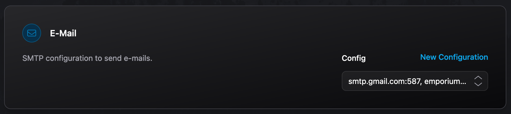

# Email Integration (SMTP)

The Emporium SMTP integration allows apps to request SMTP / Email credentials that have to be configured by the user at install time.

## Available Variables

The following variables are available to use within the [`values.emporium.yaml`](../values-emporium-yaml) file.

<!--@include: ./smtp-variables.md-->

## Configuring STMP

Users can configure SMTP configs within the settings of the Emporium UI.
Credentials configured there can then be selected for apps that request an SMTP configuration.

## Example

The following example shows how the SMTP integration can be used in [`values.emporium.yaml`](../values-emporium-yaml).

```yaml
# ...
smtp:
  enabled: true
  host: {{ .Emporium.Integrations.SMTP.Host }}
  username: {{ .Emporium.Integrations.SMTP.Username | quote }}
  password: {{ .Emporium.Integrations.SMTP.Password | quote }}
  port: {{ .Emporium.Integrations.SMTP.Port | quote }}
  from: {{ .Emporium.Integrations.SMTP.From | quote }}
```

This will result in the following input in the UI.

