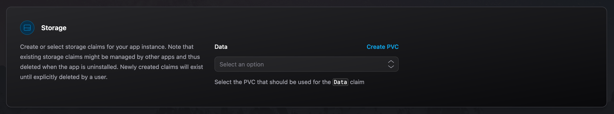

# Storage Integration

The Emporium storage integration allows users to configure pre-existing or create new volumes at install time for any app that has implemented it. It's useful for cases where you have an existing volume that you want to attach to a new app or where you want to keep a volume after the uninstallation of an app.

## Available Variables

The following variables are available to use within the [`values.emporium.yaml`](../values-emporium-yaml) file. Note that all the keys of the `.Emporium.Integrations.Storage.Claims` map you reference, will show up in the UI as a dropdown to choose a volume claim for.

<!--@include: ./storage-variables.md-->

## Example

In this example, we decided that we require a claim with the key `Data` to be supplied by the user.

```yaml
storage:
  data:
    enabled: true
    existingClaim: "{{ .Emporium.Integrations.Storage.Claims.Data.Name }}"
```

This will result in the following input in the UI (note the corresponding `Data` claim name).



