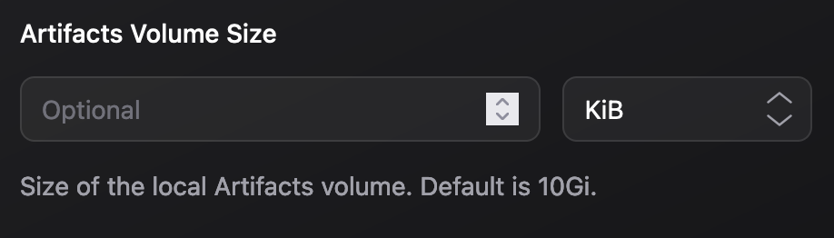

# `@userSupplied` Syntax

The `@userSupplied` syntax employs tags that permit app developers to indicate specific variables in the `values.emporium.yaml` as supplied by the user. Emporium then generates corresponding input fields on the app installation screen.

Every line should begin with `##` to be parsed. Every variable block should commence with `@userSupplied`. Subsequent tags are considered up to the next `@userSupplied` tag or the end of the file. The order of variable blocks doesn't affect the outcome. The variable name specified in `@userSupplied [variable name]` should match the usage in the template (`.Emporium.UserSupplied.[variable name]`).

## Tags

The following tags are available.

| Tag                          | Description                                                                                                 | Required | Default |
| ---------------------------- | ----------------------------------------------------------------------------------------------------------- | -------- | ------- |
| `@userSupplied [variable]`   | Identifies a variable as user-supplied. `[variable]` is the key  used in `.Emporium.UserSupplied` map.      | Yes      | ""      |
| `@label [label]`             | Sets a label for the variable.                                                                              | No       | ""      |
| `@type [type]`               | Sets the variable type. [Learn more](#type-tag).                                                            | No       | string  |
| `@description [description]` | Sets a description for the variable.                                                                        | No       | ""      |
| `@optional`                  | Indicates a user-supplied variable as optional. By default, all variables are required.                     | No       | false   |

## `@type [type]` Tag {#type-tag}

The `@type` tag specifies the variable type. Based on this type, the Emporium UI will render different input elements. The following options are available.

| Name         | Type         | Default value | Rendered in UI                                                    |
| ------------ | ---------------- | ------------- | ----------------------------------------------------------------- |
| string       | string           | ""            |                |
| boolean      | boolean          | false         |              |
| integer      | integer          | 0             |              |
| byteSize     | byteSize         | ""            |          |
| integer[]    | integer [1, 2]   | ""            |                         |
| string[]     | string["a", "b"] | ""            |                    |
| boolean      | storageClass     | ""            |  |


## Example

### String
Here's an example for a variable named `AdminPassword`. This variable can be accessed within `values.emporium.yaml` as `.Emporium.UserSupplied.AdminPassword`.

```yaml values.emporium.yaml
## @userSupplied AdminPassword
## @label Password
## @type string
## @description Must be at least 10 characters long
authentication:
  admin:
    password: {{ .Emporium.UserSupplied.AdminPassword }}
```

On the install screen of the Emporium UI, users will se a text field with the label "Password" and a description text "Must be at least 10 characters long".

### Boolean
```yaml values.emporium.yaml
## @userSupplied RocketModeEnabled
## @label RocketModeEnabled
## @type boolean
## @description Enable rocket mode if you want to moon
authentication:
  admin:
    password: {{ .Emporium.UserSupplied.RocketModeEnabled }}
```

A checkbox is displayed on the install screen.


### String enum

```yaml values.emporium.yaml
## @userSupplied ServiceType
## @label Service Type
## @type string ["LoadBalancer", "NodePort"]
## @description Plex works best when the server is reachable from the internet. For this usecase it is recommended to forward the port from your router to the service.
## @optional
service:
  type: {{ default "LoadBalancer" .Emporium.UserSupplied.ServiceType }}
```

### Integer enum


```yaml values.emporium.yaml
## @userSupplied MagicNumber
## @label MagicNumber
## @type integer [42, 69, 420]
magic:
  number: {{ default 69 .Emporium.UserSupplied.## @userSupplied MagicNumber
 }}
```

### Storage Class & byteSize

```yaml values.emporium.yaml
## @userSupplied WorkdirSize
## @label Cache Directory Size
## @type byteSize
## @description Size for cache directory (e.g. 20Gi or 900Mi).
## @optional

## @userSupplied StorageClass
## @label StorageClass
## @type storageClass
## @description Storage class used for the workdir
## @optional

storage:
  data:
    enabled: true
    storageClass: {{ .Emporium.UserSupplied.StorageClass }}
    existingClaim: ""
    accessMode: ReadWriteOnce
    size: {{ default "300Gi" .Emporium.UserSupplied.WorkdirSize }}
```