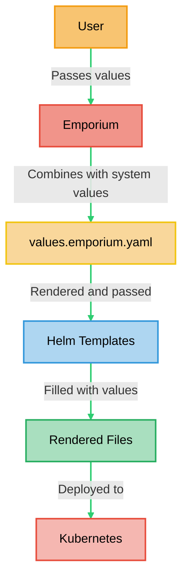

# `values.emporium.yaml` File

At its heart, an app is a Helm chart that contains a unique `values.emporium.yaml` file. This file delineates how Emporium should configure your app and what inputs it needs from the user. It serves as a template for the values fed into `helm install`.

## Available Variables

This section lists all variables available within `values.emporium.yaml`.

| Variable                                            | Description                                                                              |
| --------------------------------------------------- | ---------------------------------------------------------------------------------------- |
| `.Emporium.Name`                                    | The name of the app instance, input by the user in the Emporium UI.                      |
| `.Emporium.Annotations`                             | Annotations for ingresses, configured automatically by Emporium.                         |
| `.Emporium.UserSupplied.[your-variable-name]`       | User-supplied values, specified by the [`@userSupplied` syntax](./user-supplied-syntax). |

### DNS Integration

The following variables are provided by the [DNS integration](./integrations/dns).

<!--@include: ./integrations/dns-variables.md-->

### OIDC Integration

The following variables are provided by the [OIDC integration](./integrations/oidc).

<!--@include: ./integrations/oidc-variables.md-->

### Storage Integration

The following variables are provided by the [storage integration](./integrations/storage).

<!--@include: ./integrations/storage-variables.md-->

### Email / SMTP Integration

The following variables are provided by the [SMTP integration](./integrations/smtp).

<!--@include: ./integrations/smtp-variables.md-->

## User Supplied Variables

All variables in the form of `.Emporium.UserSupplied.[your-variable-name]` will have to have a corresponding `@userSupplied` definition.

Check out the [`@userSupplied` documentation](./user-supplied-syntax) for a more detailed explanation.

## Integrations

Emporium discovers automatically which integrations an app references in it's `values.emporium.yaml` file.
It will render the installation screen based on the used integrations and ´@userSupplied´ values.

For example, if an app uses the SMTP / Email integration, Emporium will render a dropdown menu where users can select an email account.

## Rendering Process

The following diagram illustrates the process how `values.emporium.yaml` is used to install an app in your cluster.

